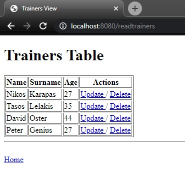

# Spring CRUD

Using Spring MVC/Data, I perform CRUD operations with a basic HTML page as View.

## Getting Started

Firstly, make sure to create the necessary table using the files in *~/Trainers_Table*  
Credentials used in DB can be found within application.properties file.
Then, proceed to run the app with your preferred IDE:

- In the starting path "/" the User is redirected to "/createtrainer", where you can create a new Trainer.

- Alternatively, the User may click below to navigate to "/readtrainers", where all the Trainers are visible.

- Finally every row of the table can be Updated/Deleted on the spot.

  

  

## Technology Stack

* [IntelliJ Ultimate Edition](https://www.jetbrains.com/idea/) - My preferred IDE
* [MySQL](https://www.mysql.com/)- Database used
* [Java 11](https://www.oracle.com/java/technologies/javase-jdk11-downloads.html) - Java version used
* [Maven](https://maven.apache.org/) - Dependency Management
* [Spring Boot](https://spring.io/projects/spring-boot) - Back-End Framework used with the following dependencies:

    * **Spring Boot DevTools**
    * **Spring Web MVC**
    * **Spring Data JPA**
    

* [Tomcat](http://tomcat.apache.org/) - Application Server used
* [JSP](https://www.oracle.com/java/technologies/jspt.html) - Java Server Pages Technology

